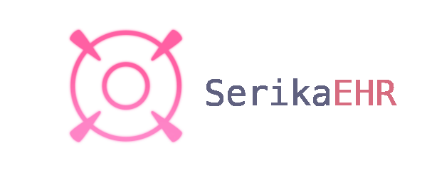

# HIATUS FOR NOW!! DO NOT EXPECT UPDATES



\


**SerikaEHR** is a lightweight, modular ETL pipeline built for handling and cleaning FHIR-formatted EHR data.

---

## Features

- **Extracts** and parses large FHIR bundles (JSON)  
- **Transforms** deeply nested data into clean tabular formats (patients, encounters, claims, etc.)  
- **Loads** data into SQL databases (SQLite or Postgres) via SQLAlchemy  
- **Logs** every step of the process with rich, colorized output  
- **Configurable and modular** — easy to extend for new resource types or data sources  

---

## Setup

### Prerequisites
- Python 3.10+

### Install dependencies
```bash
pip install pandas sqlalchemy pyyaml rich
```

### Run the pipeline

```bash
python src/main.py
```

---

## How It Works

1. **Extract** – Reads FHIR JSON bundles from `/data/raw`
2. **Transform** – Flattens the nested resources (Patient, Encounter, Condition, Claim, etc.)
3. **Load** – Inserts the cleaned data into a SQL database (default: SQLite)
4. **Log** – Writes all operations to `/logs/etl.log` with timestamps and error reports

---

## Future Plans

* Support for HL7v2 or openEHR formats
* Parquet/Arrow support for faster storage
* Prefect/Airflow integration
* Optional REST API for querying data
* CLI flags for selective pipeline execution

---

## License

This project is licensed under the **MIT License** — see [LICENSE](LICENSE) for details.

---

## Notes
Feel free to use, modify, and distribute as you see fit. Just don’t blame me if your EHR data goes haywire :3
Built using Python, pandas, SQLAlchemy, and Rich

## Disclaimer

SerikaEHR is an independent, open-source project and is not affiliated with, endorsed, or sponsored by Nexon Games, Yostar, or Blue Archive.
The character Serika and related assets belong to Nexon Games Co., Ltd.
All character references are for fan and educational purposes only.

If you are a copyright holder and believe any content used here violates your rights, please open an issue or contact me — I'll remove it immediately.